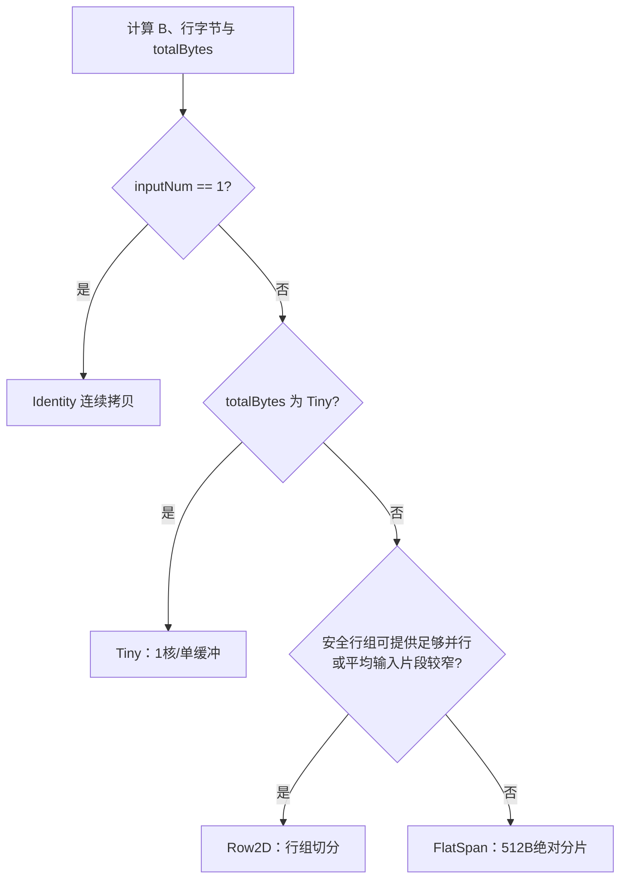

# Concat算子软硬件协同优化方案-20260728

> 适用环境：CANN 社区版 8.5.0、华为 Ascend 910B / Atlas A2  
> 分析对象：`Concat_20260722_102940.zip` 第 3 次提交  
> 方案性质：在 Case1-5 的 shape、`dim`、`dtype` 均未知时制定的黑盒自适应优化方案  
> 日期：2026-07-28

## 1. 结论先行

当前实现正确性已通过，但离榜首仍有 `129.3915 us`，需要总体加速约 `1.2973x`。Case4 和 Case5 合计占总耗时 `89.1507%`；即使 Case1-3 全部降为 0，Case4+5 的 `503.3905 us` 仍比榜首总耗时高 `68.1305 us`。因此，主优化方向必须是大负载下的多核切分和 GM 搬运效率，而不是只优化 Kernel 启动或 TilingData。

建议采用以下混合方案：

1. 先做低风险头开销优化：压缩 TilingData、将 `TPipe` 移到算子类外、按数据量选择单/双缓冲。
2. 以 **Row2D 行组切分**作为默认主路径：按 512B 访存粒度计算安全行组，跨核起始地址错开，继续利用二维 `DataCopy`/`DataCopyPad`。
3. 以 **FlatSpan 绝对字节分片**作为低 `beforeDimSize` 大数据兜底：把整个输出按连续 512B 单元均衡切核，解决 `dim=0`、`beforeDimSize=1` 或行数不足时的单核瓶颈。
4. 增加 **Tiny** 和 **Identity** 专用路径：小数据少核单缓冲；单输入直接线性拷贝。
5. 保留现有的 `KERNEL_TYPE_AIV_ONLY`、`TQueBind<VECIN,VECOUT>`、二维搬运和按字节统一 dtype 处理，这些方向已经符合官方最佳实践。
6. 每次只引入一组变化，按 P0-P4 阶段 A/B；目标设为 `prof_sum < 430 us`，给榜首 `435.26 us` 留出抖动余量。

不建议继续把当前“按逻辑列切核”作为主路径。它只保证列宽为 32B/512B 的倍数，并不保证各行上的**绝对 GM 地址**始终处于不同的 512B 区间；当行字节数不是 512B 的倍数时，相邻列核会在大量行上反复命中同一 512B 地址区间，触发官方文档所述的请求串行化。

## 2. 输入规格与数据布局

对第 `i` 个输入，统一视为：

```text
input[i] : [B, Li, A]
output   : [B, L,  A]

B  = dim 之前各维乘积
A  = dim 之后各维乘积
Li = input[i] 在 dim 维的长度
L  = sum(Li)
S  = dtype 字节数
```

关键字节量：

```text
catUnitBytes     = A * S
inputRowBytes[i] = Li * catUnitBytes
outputRowBytes   = L  * catUnitBytes
totalBytes       = B  * outputRowBytes
```

Concat 没有数值计算，本质上是把每个输入的若干 GM 字节段搬到输出。理想执行时间近似受下式约束：

```text
T >= max(
    Kernel 启动与 Scalar/Tiling 开销,
    totalBytes / 有效读带宽,
    totalBytes / 有效写带宽
)
```

不同 `dim` 会产生截然不同的搬运形态：

| 场景 | 数据特征 | 对实现的要求 |
| --- | --- | --- |
| `dim=0` 或 `B=1` | 每个输入通常是一个大连续段 | 不能因“只有 1 行”退化为单核；适合 FlatSpan |
| `dim` 为末维 | 单行内每个输入片段可能很窄，但行数多 | 适合跨多行的二维 stride 搬运，避免逐行指令 |
| 中间维 | 行数和单行片段均可能较大 | Row2D 优先，必要时 FlatSpan |
| 输入数多 | 输入描述、边界判断、DMA 指令数增加 | 压缩 Tiling；减少每 tile 的二分/扫描 |
| 非 32B 对齐 | 头尾或行跨度不能使用全对齐搬运 | 主体走对齐快路，边界走 `DataCopyPad` |

支持的四种 dtype 只影响 `S`，不需要四套计算 Kernel。继续使用 `uint8_t` 视角做纯字节搬运，可以避免 dtype 分支和 Vector 指令。

## 3. 当前性能证据

### 3.1 第 3 次提交

| Case | 耗时/us | 总耗时占比 |
| --- | ---: | ---: |
| Case1 | 10.6000 | 1.8773% |
| Case2 | 32.6205 | 5.7771% |
| Case3 | 18.0405 | 3.1950% |
| Case4 | 104.0925 | 18.4348% |
| Case5 | 399.2980 | 70.7158% |
| 合计 | 564.6515 | 100.0000% |

与榜首的量化差距：

| 指标 | 数值 |
| --- | ---: |
| 榜首 | 435.2600 us |
| 当前差距 | 129.3915 us |
| 需要降低 | 22.9153% |
| 需要加速 | 1.2973x |
| Case4+5 合计 | 503.3905 us |
| Case4+5 占比 | 89.1507% |
| 若 Case1-3 不变，Case4+5 至少需降低 | 25.7040% |

### 3.2 黑盒推断边界

由于没有 Case 的 shape、输入数、`dim` 和 dtype，不能把某一条假设当成已证实结论。本文使用以下方式控制风险：

- 从源码中找出对 shape 族敏感的确定性退化点。
- 通过运行时路径选择覆盖 `B` 大、小以及片段宽、窄的组合。
- 所有阈值均作为 A/B 起点，不写成硬件常数。
- 只将华为官方文档明确说明的 512B 冲突、搬运粒度、Tiling/TPipe 开销作为硬依据。

## 4. Ascend 910B / Ascend C 软硬件特性

### 4.1 纯搬运算子应使用 AIV

Atlas A2 为 Cube/Vector 分离架构，官方 `GetCoreNumAiv` 文档说明该接口在分离模式下返回 Vector Core 数。Concat 不使用矩阵计算单元，当前：

```cpp
KERNEL_TASK_TYPE_DEFAULT(KERNEL_TYPE_AIV_ONLY);
```

是正确选择。官方说明 AIV-only 只启动 Vector Core，可减少无关核心启动开销。核数和 UB 容量不应写死为某个 910B SKU 的固定值，应由：

```cpp
platform.GetCoreNumAiv();
platform.GetCoreMemSize(platform_ascendc::CoreMemType::UB, ubSize);
```

在 Tiling 阶段查询。

### 4.2 MTE2/MTE3 与双缓冲

Concat 的主流水是：

```text
GM --MTE2--> UB --MTE3--> GM
```

`TQueBind<VECIN,VECOUT>` 可让搬入和搬出复用同一 LocalTensor，避免无意义的 LocalTensor 到 LocalTensor Vector 拷贝。当前实现已经使用该结构，应保留。

双缓冲可让下一 tile 的 MTE2 与上一 tile 的 MTE3 重叠，但官方指南同时指出：小数据只需一次处理时，强制 DoubleBuffer 可能适得其反。因此应由 TilingKey 生成单缓冲 Tiny 模板和双缓冲通用模板，而不是所有 case 固定 `2 * 64 KiB`。

### 4.3 512B 地址粒度是切核的核心约束

《CANN 社区版 8.5.0 Ascend C 算子开发指南》3.6.5.4 指出，MTE2、MTE3、Scalar 对 GM 的地址请求按 512B 粒度对齐处理；多个核同时访问同一连续 512B 区间时，请求会因一致性要求串行，且参与冲突的核越多，劣化越明显。指南推荐调整访问顺序或从列切分改为行切分。

指南 3.6.5.2 还指出，Atlas A2 上 GM 地址 512B 对齐更有利于发挥带宽；文中测试的最差场景里，32B 对齐带宽只有 512B 对齐场景的约 70%。该数值是官方示例而非本算子的收益承诺。

### 4.4 单次搬运大小与二维 DMA

官方指南 3.6.5.1 给出的经验是：单次搬运长度达到 16KB 以上通常更有利于发挥带宽。3.6.5.3 建议通过 `blockCount`、`blockLen`、`srcStride`、`dstStride` 一次完成二维间隔搬运，避免 Kernel 中逐行循环。

因此，本算子的目标不是盲目追求最多核，而是同时满足：

- 单核有足够字节量摊薄启动开销。
- 每条 DMA 尽量聚合多个行块。
- 多核地址不反复落入同一 512B 区间。
- 尾部不对齐由 `DataCopyPad` 正确处理。

## 5. 当前源码审计

### 5.1 已经正确的部分

| 当前实现 | 评价 |
| --- | --- |
| `uint8_t` 视角统一搬运 | 正确覆盖 float32/float16/int32/int8 |
| `KERNEL_TYPE_AIV_ONLY` | 符合纯搬运算子特征 |
| `TQueBind<VECIN,VECOUT>` | 避免冗余 Vector 拷贝 |
| `DataCopyPad` 支持非对齐 | 满足规格中的非 32 整倍数场景 |
| 以二维参数搬运多行 | 比逐行循环更有效 |
| `GetCoreNumAiv()` | 未写死物理核数 |
| Kernel 字节偏移使用 `uint64_t` | 大偏移方向正确 |

### 5.2 确定性风险

#### 风险一：512B“列宽”不等于 512B“绝对地址隔离”

当前 host 枚举 `colBlockBytes=512` 或其他 32B 对齐列宽。对输出第 `r` 行，核 `c` 的起始地址为：

```text
addr(r,c) = outputBase + r * outputRowBytes + c * colBlockBytes
```

只有当 `outputRowBytes % 512 == 0` 时，相同行列模式才稳定落在 512B 边界。若行长只满足 32B 对齐、但不是 512B 对齐，`r * outputRowBytes` 会在 512B 内轮转；相邻列核处理 512B 宽区间时，会在许多行的边界附近同时触达同一 512B 请求区间。输入侧还叠加了每个输入不同的 `inputRowBytes` 和前缀偏移，问题更难由一个 `colBlockBytes` 解决。

这正是官方“避免同地址访问”案例中列切分容易劣化的模式。

#### 风险二：非 32B 行长回退可能只有一个核

当前逻辑在：

```cpp
if ((rowBytes % 32) != 0) return rowSplit;
```

后只按 `beforeDimSize` 切核。若 `B=1`，无论总输出多大都只启一个核。`dim=0`、前缀维乘积很小、输出行不对齐，均可能命中该路径。这是 Case5 一类大耗时场景的高风险退化点。

#### 风险三：TilingData 每核复制约 2KB 数组

当前 Tiling 含两个固定数组：

```text
inputCatLen[256]    : 1024B
inputCatOffset[256] : 1024B
```

再加标量字段，每个核执行 `GET_TILING_DATA` 时都从 GM 拷到栈。官方指南明确说明此过程可达 us 级，对小 shape 尤其明显。`inputCatOffset` 可由长度前缀和生成；规格中 `Li <= 10000`，长度可用 `uint16_t` 保存。数组负载可从约 2048B 降到最多 512B，常见输入数不超过 8 时只需复制 16B。

#### 风险四：`TPipe` 是 Kernel 类成员

当前 `AscendC::TPipe pipe;` 位于 `KernelConcat` 内。官方 3.6.3.3 建议在任何场景下将 `TPipe` 建在算子类外，避免影响类内 Scalar 常量折叠与传播。

#### 风险五：代价模型不能反映真实硬件瓶颈

`DMA_SETUP_COST=4096` 是无量纲经验值，当前 `EstimateColumnCost` 未建模：

- Kernel 启动开销和单核最小负载；
- 512B 绝对地址冲突；
- MTE2 与 MTE3 的不同瓶颈；
- 输入数引起的边界碎片；
- L2 模式；
- 实际 UB 容量和 tile 数。

它可能把“更多核、512B 窄列”误判为最优。

#### 风险六：host shape 乘积使用 `uint32_t`

`beforeDimSize`、`afterDimSize` 及若干前缀和在 host 先以 `uint32_t` 相乘或相加。规格各维上界的乘积可超过 32 位；即使实际可分配 tensor 较小，也应做 64 位检查，避免溢出后选错路径或产生错误地址。

#### 风险七：始终走 `DataCopyPad`

`DataCopyPad` 是正确性兜底，但对源、目的、长度和 stride 均满足 32B 对齐的主体区域，可 A/B 普通 `DataCopy` 快路。不能直接全量替换：非对齐头尾、源和目的模 32 不同的片段仍必须使用 Pad 路径。

## 6. 候选方案比较

| 方案 | 核心做法 | 优点 | 主要风险 | 结论 |
| --- | --- | --- | --- | --- |
| A. 修补现有列切分 | 增加 512B 行长判断、单核负载阈值 | 改动小 | `B` 小/行不对齐仍难并行；输入侧冲突仍复杂 | 仅适合短期止损 |
| B. Row2D + FlatSpan 混合 | 行组主路径，连续绝对字节分片兜底 | 同时覆盖窄行、多行、单行大数据；保留二维 DMA | 路径与 TilingKey 增加 | **推荐** |
| C. 全部统一为 FlatSpan | 所有输出按连续字节切核 | 切核直观，负载均衡 | 多输入窄片段时 Scalar 映射和 DMA 碎片严重 | 不作为通用主路径 |

推荐 B。路径选择如下：



## 7. 推荐实现

### 7.1 P0：先压缩头开销

#### 7.1.1 64 位安全字节计算

```cpp
static bool CheckedMul(uint64_t a, uint64_t b, uint64_t &out)
{
    if (a != 0 && b > UINT64_MAX / a) {
        return false;
    }
    out = a * b;
    return true;
}

uint64_t before = 1;
uint64_t after = 1;
for (uint32_t i = 0; i < dim; ++i) {
    if (!CheckedMul(before, static_cast<uint64_t>(shape.GetDim(i)), before)) {
        return ge::GRAPH_FAILED;
    }
}
for (uint32_t i = dim + 1; i < rank; ++i) {
    if (!CheckedMul(after, static_cast<uint64_t>(shape.GetDim(i)), after)) {
        return ge::GRAPH_FAILED;
    }
}
```

`Li` 按规格校验 `Li <= 10000` 后写入 `uint16_t`；`totalCatLen`、所有字节量和地址偏移仍使用 `uint64_t`。

#### 7.1.2 紧凑 Tiling 结构

以下为结构意图；落地时用当前工程对应的 `TILING_DATA_FIELD_DEF` 宏注册：

```cpp
enum class ConcatPath : uint8_t {
    TINY = 0,
    ROW_2D = 1,
    FLAT_SPAN = 2,
    IDENTITY = 3,
};

struct ConcatBaseTiling {
    uint64_t before;
    uint64_t after;
    uint64_t outputRowBytes;
    uint64_t totalBytes;
    uint32_t rowGroup;
    uint32_t tileBytes;
    uint16_t inputNum;
    uint8_t dtypeBytes;
    uint8_t path;
};

struct ConcatTiling {
    ConcatBaseTiling base;
    uint16_t inputCatLen[256];
};
```

删除以下冗余项：

- `inputCatOffset[256]`：Kernel 通过 `inputCatLen` 累加。
- `dim`、`dimNum`：Kernel 不使用。
- `usedCoreNum`：`SetBlockDim` 已限定实际启动核数。
- 当前 `splitMode`、`rowPeriod`、`rowSliceNum`、`colCoreNum`、`colBlockBytes`：由新路径字段替代。

用 TilingKey 区分：

```text
TINY_8 / TINY_256
ROW_8 / ROW_256
SPAN_8 / SPAN_256
IDENTITY
```

Kernel 先取得 GM 指针，只把频繁访问的 base 和必要长度数组复制到栈：

```cpp
GET_TILING_DATA_PTR_WITH_STRUCT(ConcatTiling, tilingPtr, tiling);
COPY_TILING_WITH_STRUCT(
    ConcatBaseTiling, tilingPtr->base, basePtr);

if (TILING_KEY_IS(TINY_8)) {
    COPY_TILING_WITH_ARRAY(
        uint16_t, 8, tilingPtr->inputCatLen, len8Ptr);
    // 使用 (*len8Ptr)[i]
    RunTiny(*basePtr, *len8Ptr);
} else if (TILING_KEY_IS(ROW_8)) {
    COPY_TILING_WITH_ARRAY(
        uint16_t, 8, tilingPtr->inputCatLen, len8Ptr);
    RunRow2D(*basePtr, *len8Ptr);
} else if (TILING_KEY_IS(SPAN_8)) {
    COPY_TILING_WITH_ARRAY(
        uint16_t, 8, tilingPtr->inputCatLen, len8Ptr);
    RunFlatSpan(*basePtr, *len8Ptr);
}
```

`TILING_KEY_IS` 按官方约束分别用于 `if/else if` 分支，不组合成普通布尔表达式。256 路分支同理复制实际需要的宽数组。

若当前编译形态不支持这些宏，则退一步：仍用 `GET_TILING_DATA`，但至少删除 offset 数组并改用 `uint16_t`，先把 TilingData 从约 2KB 降到约 0.55KB。

#### 7.1.3 `TPipe` 外置与 ShapeInfo 缩减

```cpp
#define K_MAX_SHAPE_DIM 0
#include "kernel_operator.h"
#include "kernel_operator_list_tensor_intf.h"

extern "C" __global__ __aicore__
void concat(GM_ADDR srcList, GM_ADDR dst,
            GM_ADDR workspace, GM_ADDR tiling)
{
    KERNEL_TASK_TYPE_DEFAULT(KERNEL_TYPE_AIV_ONLY);
    GET_TILING_DATA_PTR_WITH_STRUCT(ConcatTiling, tilingPtr, tiling);

    AscendC::TPipe pipe;
    KernelConcat op(&pipe);
    op.Init(srcList, dst, tilingPtr);
    op.Process();
}

class KernelConcat {
public:
    __aicore__ explicit KernelConcat(AscendC::TPipe *pipe) : pipe_(pipe) {}
private:
    AscendC::TPipe *pipe_;
};
```

本 Kernel 不使用 `ShapeInfo`，`K_MAX_SHAPE_DIM=0` 可按官方建议减少栈空间。

### 7.2 P1：Row2D 作为默认路径

#### 7.2.1 计算 512B 安全行组

对任意行字节数 `b`，使 `rows * b` 为 512B 倍数的最小行周期为：

```text
period(b) = 512 / gcd(b, 512)
```

对输出行和所有非空输入行取最小公倍数：

```cpp
static uint32_t Period512(uint64_t rowBytes)
{
    return 512U / std::gcd<uint32_t>(
        static_cast<uint32_t>(rowBytes & 511U), 512U);
}

uint32_t rowGroup = Period512(outputRowBytes);
for (uint32_t i = 0; i < inputNum; ++i) {
    const uint64_t inRow =
        static_cast<uint64_t>(inputCatLen[i]) * catUnitBytes;
    if (inRow != 0) {
        rowGroup = std::lcm(rowGroup, Period512(inRow));
    }
}
```

所有周期都是 512 的因数，因此 `rowGroup <= 512`。以整行组作为核间边界后：

- 各核输出起始行的相对偏移是 512B 的倍数；
- 对每个输入，各核源起始行的相对偏移也是 512B 的倍数；
- 继续按输入做二维多行搬运，无需逐字节映射；
- 最后一个不足完整行组的尾块仍由一个核处理。

这比当前只计算 32B `rowPeriod` 且 Kernel 根本不使用它更贴合 910B 的实际访存约束。

#### 7.2.2 按行组均衡切核

```cpp
const uint64_t groupCount = CeilDiv(before, rowGroup);
const uint32_t rowCores =
    static_cast<uint32_t>(std::min<uint64_t>(desiredCores, groupCount));

// Kernel
const uint64_t core = GetBlockIdx();
const uint64_t beginGroup = groupCount * core / rowCores;
const uint64_t endGroup   = groupCount * (core + 1) / rowCores;
const uint64_t beginRow   = beginGroup * rowGroup;
const uint64_t endRow     = Min(before, endGroup * rowGroup);
```

每个核仍按输入顺序调用二维搬运：

```cpp
uint64_t outputPrefix = 0;
for (uint32_t i = 0; i < inputNum; ++i) {
    const uint64_t inRowBytes =
        static_cast<uint64_t>(inputLen[i]) * catUnitBytes;
    if (inRowBytes == 0) {
        continue;
    }

    Copy2D(
        inputGm[i],
        beginRow * inRowBytes,
        beginRow * outputRowBytes + outputPrefix,
        endRow - beginRow,
        inRowBytes,
        0,
        outputRowBytes - inRowBytes);

    outputPrefix += inRowBytes;
}
```

`Copy2D` 内部按 UB 容量和 `blockCount <= 4095` 分批，不回退为逐行循环，除非 stride 超过 API 表达范围。

### 7.3 P2：FlatSpan 解决低行数大数据

#### 7.3.1 使用条件

初始黑盒规则：

```cpp
constexpr uint64_t TINY_BYTES = 64 * 1024;
constexpr uint64_t MIN_BYTES_PER_CORE = 64 * 1024;
constexpr uint64_t SPAN_MIN_TOTAL = 256 * 1024;
constexpr uint64_t SPAN_MIN_AVG_PIECE = 4 * 1024;

desiredCores = Clamp<uint32_t>(
    1, aivCores,
    static_cast<uint32_t>(totalBytes / MIN_BYTES_PER_CORE));

rowCores = Min<uint64_t>(desiredCores, CeilDiv(before, rowGroup));
avgPieceBytes = outputRowBytes / nonEmptyInputNum;

useFlatSpan =
    totalBytes >= SPAN_MIN_TOTAL &&
    rowCores * 2 < desiredCores &&
    avgPieceBytes >= SPAN_MIN_AVG_PIECE;
```

这些值是首轮测试候选，不是硬件定值。建议只搜索：

```text
MIN_BYTES_PER_CORE : 32 / 64 / 128 KiB
SPAN_MIN_TOTAL     : 128 / 256 / 512 KiB
SPAN_MIN_AVG_PIECE : 2 / 4 / 8 KiB
```

只保留能稳定改善 Case4+5 且不显著伤害 Case1-3 的组合。

#### 7.3.2 按连续 512B 单元均衡

```cpp
constexpr uint64_t GM_UNIT = 512;
const uint64_t units = CeilDiv(totalBytes, GM_UNIT);
const uint64_t base = units / usedCores;
const uint64_t rem  = units % usedCores;

const uint64_t core = GetBlockIdx();
const uint64_t startUnit = core * base + Min(core, rem);
const uint64_t count = base + (core < rem ? 1 : 0);

const uint64_t begin = startUnit * GM_UNIT;
const uint64_t end = Min(totalBytes, (startUnit + count) * GM_UNIT);
```

与当前“每行都切列”不同，FlatSpan 只在每对相邻核之间产生一次分片边界。输出范围互不重叠且边界按绝对 512B 单元划分；即使某边界映射到输入片段内部后源地址不是 512B 对齐，也最多影响边界附近的一次请求，不会在每一行重复制造冲突。每核负载不低于 32-128KiB 后，边界代价可被主体搬运摊薄。

#### 7.3.3 输出区间映射回输入

关键循环如下；初始化时只扫描一次找到 `begin` 所在输入，之后按输入边界和行边界递增：

```cpp
uint64_t cursor = begin;
uint64_t row = cursor / outputRowBytes;
uint64_t col = cursor - row * outputRowBytes;

uint32_t input = 0;
uint64_t prefix = 0;
uint64_t inRowBytes = 0;
FindInputByColumn(col, inputLen, inputNum, catUnitBytes,
                  input, prefix, inRowBytes);

while (cursor < end) {
    const uint64_t inOffset = col - prefix;
    const uint64_t take = Min3(
        end - cursor,
        inRowBytes - inOffset,
        outputRowBytes - col);

    const uint64_t srcOffset = row * inRowBytes + inOffset;
    SubmitLinear(inputGm[input], srcOffset, cursor, take);

    cursor += take;
    col += take;

    if (col == outputRowBytes) {
        ++row;
        col = 0;
        input = 0;
        prefix = 0;
        while (input < inputNum && inputLen[input] == 0) {
            ++input;
        }
        inRowBytes = input < inputNum
            ? static_cast<uint64_t>(inputLen[input]) * catUnitBytes
            : 0;
    } else if (inOffset + take == inRowBytes) {
        prefix += inRowBytes;
        do {
            ++input;
        } while (input < inputNum && inputLen[input] == 0);
        inRowBytes = input < inputNum
            ? static_cast<uint64_t>(inputLen[input]) * catUnitBytes
            : 0;
    }
}
```

生产代码应在进入循环前保证 `outputRowBytes>0`，并将 `inRowBytes==0` 或 `input==inputNum` 视为非法 Tiling/结束保护，避免零步长循环。为避免循环中的 64 位除法过多，只在每核初始化时计算一次 `row/col`；之后通过条件递增。`FindInputByColumn` 对 `inputNum<=8` 直接展开线性扫描，对大输入数用前缀扫描一次即可，不再为每个 tile 二分。

### 7.4 Identity 与 Tiny 专用路径

#### Identity

`inputNum==1` 时，Concat 等价于一段连续拷贝，与 `dim` 无关。直接复用 FlatSpan 的 512B 切分，但不做任何输入定位：

```cpp
SubmitLinear(inputGm[0], begin, begin, end - begin);
```

#### Tiny

当 `totalBytes <= TINY_BYTES`：

- 只启 1 核；
- 单缓冲；
- 不计算 `rowGroup` 和复杂代价模型；
- 顺序搬运输入；
- 若整个输入连续段不超过 tile，单次完成。

Tiny 阈值先测试 32KiB、64KiB；Case1 仅 10.6us，保护其不回退比追求大幅下降更重要。

### 7.5 核数与 UB 自适应

```cpp
auto platform =
    platform_ascendc::PlatformAscendC(context->GetPlatformInfo());
const uint32_t aivCores =
    std::max<uint32_t>(1, platform.GetCoreNumAiv());

uint64_t ubSize = 0;
platform.GetCoreMemSize(
    platform_ascendc::CoreMemType::UB, ubSize);

const uint32_t bufferNum = isTiny ? 1 : 2;
const uint64_t reserve = 8 * 1024;
const uint64_t usable = ubSize > reserve ? ubSize - reserve : ubSize;
const uint32_t tileBytes = AlignDown<uint32_t>(
    static_cast<uint32_t>(
        std::min<uint64_t>(64 * 1024, usable / bufferNum)),
    512);
```

首轮保持 64KiB 上限，先消除调度瓶颈。P3 再测试 32KiB、64KiB 和在实际 UB 预算内的更大 tile，避免同时改变太多变量。

### 7.6 对齐主体快路 + Pad 边界

```cpp
const bool fullyAligned =
    ((srcOffset | dstOffset | rowBytes |
      srcGapBytes | dstGapBytes) & 31U) == 0;

if (fullyAligned) {
    DataCopyParams in;
    in.blockCount = rows;
    in.blockLen   = rowBytes / 32;
    in.srcStride  = srcGapBytes / 32;
    in.dstStride  = 0;
    DataCopy(local, inputGm[srcOffset], in);

    DataCopyParams out;
    out.blockCount = rows;
    out.blockLen   = rowBytes / 32;
    out.srcStride  = 0;
    out.dstStride  = dstGapBytes / 32;
    DataCopy(outputGm[dstOffset], local, out);
} else {
    // 保留当前 DataCopyExtParams + DataCopyPad，
    // 精确处理非 32B 的行、头部和尾部。
    CopyWithPad(...);
}
```

线性片段仅在 `srcOffset % 32 == dstOffset % 32` 时才能先搬一个非对齐 head，再让源、目的同时进入对齐主体；若二者模 32 不同，整段继续走 Pad。所有快路必须通过非对齐回归集后再保留。

### 7.7 L2 CacheMode 仅做末期 A/B

Concat 对输入通常只读一次、输出只写一次，理论上可测试：

```cpp
inputGm.SetL2CacheHint(
    AscendC::CacheMode::CACHE_MODE_DISABLE);
outputGm.SetL2CacheHint(
    AscendC::CacheMode::CACHE_MODE_DISABLE);
```

但不能默认关闭。评测可能重复执行同一 case，默认 L2 命中也可能带来收益；而输出是否很快被下游读取同样未知。将 L2 放到 P4，分别比较：

1. 默认模式；
2. 只对输入 disable；
3. 输入和输出均 disable。

只按五个 Case 的稳定 `prof_sum` 决定，不根据理论猜测提交。

## 8. 实施顺序与 A/B 门槛

| 阶段 | 改动 | 主要验证目标 | 预期影响 |
| --- | --- | --- | --- |
| P0 | 64 位字节计算、紧凑 Tiling、`TPipe` 外置、`K_MAX_SHAPE_DIM=0` | 正确性不变；Case1-3 不回退 | 降低头开销和 Scalar |
| P1 | 512B Row2D 行组；核数按最小负载限制 | Case4/5 下降；MTE2/MTE3 冲突减轻 | 主收益阶段 |
| P2 | FlatSpan + Identity + Tiny | `B` 小的大 case 不再单核 | 主收益阶段 |
| P3 | 对齐 `DataCopy` 快路、tile/阈值小范围搜索 | 带宽提高、指令数下降 | 精调 |
| P4 | L2 CacheMode 三组 A/B | 只保留稳定最优模式 | 可选收益 |

每阶段提交门槛：

- 所有正确性 Case 必须通过。
- 单 Case 回退不超过 `max(1 us, 2%)`；若超过，必须由 Case4/5 的更大收益补偿，且 `prof_sum` 至少改善 2%。
- 连续运行至少 5 次，取中位数，同时记录最大值，避免单次抖动误导。
- 不在同一轮同时更改调度、tile 和 L2，以便根据结果定位原因。
- 最终目标：`prof_sum < 430 us`；这是竞赛目标，不是无真实 Case 数据下的性能承诺。

建议的阶段性预算：

| Case | 当前/us | 建议目标/us |
| --- | ---: | ---: |
| Case1 | 10.6000 | 不高于 11 |
| Case2 | 32.6205 | 不高于 32 |
| Case3 | 18.0405 | 不高于 18 |
| Case4 | 104.0925 | 85-90 |
| Case5 | 399.2980 | 280-285 |
| 合计 | 564.6515 | 426-436 |

真正突破榜首主要依赖 Case5；若 P1/P2 后 Case5 仍在 330us 以上，应优先查看地址冲突、实际启核数和单 DMA 长度，而不是继续微调 P0。

## 9. Profiling 方案

官方指南给出的示例命令可用于单算子对比：

```bash
msprof op --launch-count=3 --output=./prof ./execute_concat_op
```

重点指标及解释：

| 文件/指标 | 观察目的 | 结果解释 |
| --- | --- | --- |
| `PipeUtilization.csv`: `aiv_mte2_time(us)` | GM -> UB | P1 后显著下降，说明读冲突/调度改善 |
| `PipeUtilization.csv`: `aiv_mte3_time(us)` | UB -> GM | P1/P2 后下降，说明输出分片冲突减少 |
| `PipeUtilization.csv`: `aiv_scalar_time(us)` | 边界定位、循环、Tiling 访问 | P0/P2 不应显著抬高 |
| `Memory.csv`: `aiv_gm_to_ub_bw(GB/s)` | 有效读带宽 | 大 Case 应提升 |
| `Memory.csv`: `aiv_main_mem_write_bw(GB/s)` | 主存写带宽 | 大 Case 应提升 |
| 各核 task duration | 核间均衡和尾核 | 最慢核与中位核差距应缩小 |
| 实际 blockDim | 是否过度/不足并行 | 验证 Tiny、Row、Span 分流 |

建议额外在 host 临时打印以下 Tiling 决策，完成调参后关闭：

```text
path, inputNum, before, after, outputRowBytes, totalBytes,
rowGroup, desiredCores, usedCores, tileBytes, avgPieceBytes
```

黑盒结果的归因规则：

- P0 主要改善 Case1-3：确认此前受 Tiling/Scalar/启动开销限制。
- P1 主要改善 Case4/5：确认此前存在列切分冲突或行组负载问题。
- P2 主要改善某个大 Case：该 Case 很可能是 `B` 小或 `dim=0` 类布局。
- P2 后 Scalar 上升且总耗时变差：FlatSpan 门槛过低，回到 Row2D 或提高平均片段阈值。
- L2 disable 只改善首轮、不改善重复统计：保留默认 L2。

## 10. 正确性与边界回归

至少覆盖：

1. dtype：float32、float16、int32、int8。
2. `dim`：0、中间、末维、负 dim。
3. 输入数：1、2、8、9、255、256。
4. 所有维度的 32B/512B 对齐与非对齐组合。
5. `B=1` 且输出很大，验证 FlatSpan 多核。
6. `A=1` 且输入片段很窄，验证 Row2D 二维搬运。
7. 输出最后不足 32B、不足 512B 的尾块。
8. 每核不足一个完整 rowGroup 的尾核。
9. 单次二维 `blockCount` 跨越 4095 的分批。
10. 字节乘积接近或超过 32 位边界，验证 host 和 Kernel 均无截断。
11. 若框架允许空 tensor，覆盖 `Li=0` 及多个连续空输入；若规格严格禁止，则 host 明确拒绝。
12. 输入除拼接维外 shape 一致、dtype 一致；非法输入在 host 失败，不进入 Kernel。

参考结果使用 `torch.cat`，按字节或 dtype 精确比对。Concat 不涉及浮点计算，不应使用容差比较。

## 11. 官方资料整理

### 11.1 本地官方指南

《CANN 社区版 8.5.0 Ascend C 算子开发指南 01》，文档版本 01（2026-03-06）：

| 页码 | 本方案使用的结论 |
| --- | --- |
| 429 | 微秒级算子应平衡启核开销与单核计算量 |
| 430 | `GET_TILING_DATA` 从 GM 拷到栈，TilingData 应尽量小 |
| 431-433 | `TPipe` 建议放在 Kernel 类外 |
| 434-435 | DoubleBuffer 可重叠流水，但小数据可能回退 |
| 437 | 单次搬运达到 16KB 以上通常更利于带宽 |
| 438-439 | Atlas A2 的 GM 512B 对齐优势 |
| 440 | 用二维搬运参数替代逐行循环 |
| 441-444 | GM 同一 512B 区间多核访问会串行；可由列切分改为行切分 |
| 445-447 | 一次性数据可测试 L2 bypass，但需结合实际复用 |
| 449-450 | 纯搬运使用 `TQueBind` 复用 VECIN/VECOUT |
| 451-452 | 未使用 ShapeInfo 时缩减维度以优化栈 |
| 1052-1053 | `DataCopyExtParams` 的 block/stride 范围与单位 |
| 1391-1397 | Tiling 指针、局部结构/数组复制和 TilingKey 宏 |
| 2355-2359 | `GetCoreNumAiv`、`GetCoreMemSize`、`GetCoreMemBw` |

### 11.2 华为官方在线资料

| 资料 | 与本方案的关系 |
| --- | --- |
| [什么是 Ascend C - CANN 8.5](https://www.hiascend.com/document/detail/zh/CANNCommunityEdition/850/opdevg/Ascendcopdevg/atlas_ascendc_map_10_0002.html) | Ascend C API 层次和 Atlas A2 支持范围 |
| [GetCoreNumAiv - CANN 8.5](https://www.hiascend.com/document/detail/zh/CANNCommunityEdition/850/API/ascendcopapi/atlasascendc_api_07_1031.html) | 运行时获取分离架构的 Vector Core 数 |
| [GetCoreMemSize - CANN 8.5](https://www.hiascend.com/document/detail/zh/CANNCommunityEdition/850/API/ascendcopapi/atlasascendc_api_07_1034.html) | 查询 UB 容量，避免写死 |
| [设置 Kernel Type - CANN 8.5](https://www.hiascend.com/document/detail/en/canncommercial/850/API/ascendcopapi/atlasascendc_api_07_0218.html) | AIV-only 只启动 Vector Core，减少无关启动 |
| [DataCopyPad - CANN 8.5](https://www.hiascend.com/document/detail/zh/CANNCommunityEdition/850/API/ascendcopapi/atlasascendc_api_07_0265.html) | 非对齐搬运与扩展参数约束 |
| [TQueBind 简介 - CANN 8.5](https://www.hiascend.com/document/detail/zh/CANNCommunityEdition/850/API/ascendcopapi/atlasascendc_api_07_0147.html) | VECIN/VECOUT 绑定、内存与同步 |
| [纯搬运类算子 VECIN/VECOUT 复用](https://www.hiascend.com/document/detail/zh/CANNCommunityEdition/850/opdevg/Ascendcopdevg/atlas_ascendc_best_practices_10_0027.html) | 去除冗余 LocalTensor 拷贝 |
| [避免 TPipe 在对象内创建](https://www.hiascend.com/document/detail/zh/CANNCommunityEdition/850/opdevg/Ascendcopdevg/atlas_ascendc_best_practices_10_0028.html) | 降低 Scalar 开销 |
| [GET_TILING_DATA_WITH_STRUCT - CANN 8.5](https://www.hiascend.com/document/detail/zh/CANNCommunityEdition/850/API/ascendcopapi/atlasascendc_api_07_0215.html) | 按结构读取 Tiling 的官方接口 |
| [SetL2CacheHint - CANN 8.5](https://www.hiascend.com/document/detail/zh/CANNCommunityEdition/850/API/ascendcopapi/atlasascendc_api_07_00033.html) | Atlas A2 上控制 GlobalTensor L2 模式 |
| [多核 Tiling - CANN 8.5](https://www.hiascend.com/document/detail/zh/CANNCommunityEdition/850/opdevg/Ascendcopdevg/atlas_ascendc_10_0035.html) | host 分核与 Kernel 取块基本方法 |
| [msProf 指令流水图 - CANN 8.5](https://www.hiascend.com/document/detail/zh/CANNCommunityEdition/850/devaids/optool/atlasopdev_16_0087.html) | 验证 MTE2/MTE3/Scalar 瓶颈 |
| [CANN asc-devkit 官方仓库](https://gitcode.com/cann/asc-devkit/blob/master/docs/zh/api/README.md) | API 文档与样例入口 |

### 11.3 算子语义参考

- [PyTorch 2.5 `torch.cat`](https://docs.pytorch.org/docs/2.5/generated/torch.cat.html#torch.cat)：沿给定维连接张量序列。

本文没有引用论坛中的非官方 910B 核数、UB 或峰值带宽数字。不同产品形态和软件版本可能变化，实际实现通过平台 API 查询，并以评测和 msProf 结果定阈值。

## 12. 最终推荐提交路线

最优先落地顺序：

1. **提交 A**：P0，只做 64 位、Tiling 压缩、`TPipe` 外置、ShapeInfo 缩减。
2. **提交 B**：P1，用 512B Row2D 行组替换当前列切分。
3. **提交 C**：P2，加入 FlatSpan、Identity、Tiny 和核数负载门槛。
4. **提交 D**：P3，只搜索 3 组核负载阈值和 2-3 组 tile。
5. **提交 E**：P4，L2 三组 A/B；无稳定收益则回退默认模式。

若只能进行一次大改，直接选择 **P0 + P1 + P2**，但保留独立 TilingKey，便于从五个 Case 的差分结果判断具体命中了哪条路径。核心原则是：

```text
小数据：少核、少 Tiling、单缓冲
多行窄片段：512B 安全行组 + 二维 DMA
少行大数据：绝对 512B 连续分片
单输入：无映射的线性拷贝
非对齐：主体快路 + DataCopyPad 边界
```

这套结构不依赖 Case1-5 的先验 shape，能够用运行时信息覆盖当前实现最危险的两端：列切分造成的 512B 冲突，以及 `beforeDimSize` 很小时的大数据单核退化。
